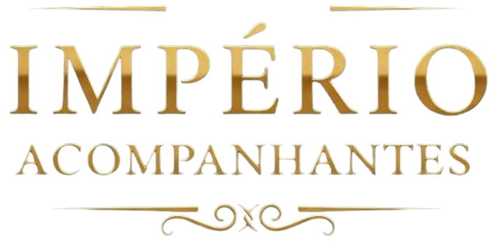

# 🔱 Império Acompanhantes | Acompanhantes de Luxo em São Paulo

<p align="center">
  
</p>

Este é o repositório oficial do website **Império Acompanhantes**, focado em apresentar acompanhantes de luxo em São Paulo com alto padrão e discrição garantida. O site é desenvolvido com **HTML5**, **CSS3** (incluindo estilos responsivos e o uso de variáveis CSS), e **JavaScript** para interatividade.

---

## 🚀 Tecnologias Utilizadas

<p align="left">
  
  
  
  
</p>

* **HTML5:** Estrutura semântica do website.
* **CSS3:** Estilização, incluindo layouts **responsivos** para diferentes dispositivos.
    * Uso de **variáveis CSS** (`:root`) para gerenciamento de cores e temas.
    * Uso da biblioteca **Font Awesome** para ícones.
* **JavaScript (ES6+):** Implementação de funcionalidades interativas, como:
    * Funcionalidade de **Acordeão** (FAQ).
    * Contador e toggle de **Favoritos**.
    * Menu de navegação **responsivo** (`menu-icon`).

---

## 📁 Estrutura do Projeto

Abaixo está a organização dos diretórios e arquivos do website **Império Acompanhantes**.

---

### Visão Geral dos Arquivos

* **🔱 IMPERIO-ACOMPANHANTES/:** Diretório raiz do projeto.
* **🌐 Páginas HTML:**
    * `index.html`: O arquivo **HTML principal** que serve como a página inicial (Home) da aplicação.
    * `aline.html`, `harume.html`, `karina.html`, `Lauretinha.html`, `Layla.html`, `May.html`, `Stefanny.html`, `Taynah.html`: Arquivos que representam as **Páginas individuais** de cada acompanhante.
* **📄 Arquivos de Estilo e Script na Raiz:**
    * `style.css`: Arquivo para os estilos **CSS globais** (estilos principais).
    * `responsivo.css`: Arquivo para estilos de **Media Queries globais** (responsividade).
    * `script.js`: **Ponto de entrada do JavaScript** para funcionalidades do DOM e interatividade do site.

---

### Detalhamento dos Diretórios

* **🎨 `css/`:** Contém as **folhas de estilo CSS** específicas para cada página ou componente.
    * `aline.css`, `harume.css`, `karina.css`, `Lauretinha.css`, `Layla.css`, `May.css`, `Stefanny.css`, `Taynah.css`: Estilos específicos para as páginas individuais de cada acompanhante.
    * `responsivo-pagina.css`: Estilos de responsividade mais detalhados ou específicos.
* **🖼️ `img/`:** Pasta para armazenar **Ativos reutilizáveis**, como imagens e ícones.
    * `logo-1.png`: O **Logotipo principal** da aplicação.
    * `favicon.ico`: O **ícone** exibido na aba do navegador.
    * `aline/`, `harume/`, `karina/`, `Lauretinha/`, `Layla/`, `May/`, `Stefanny/`, `Taynah/`: Subpastas para as **fotos das acompanhantes**.
        * Ex: `aline-1.jpg ... aline-5.jpg`: Conjunto de imagens de alta qualidade para a acompanhante Aline.
* **💡 `js/`:** Responsável por agrupar os scripts JavaScript.
    * `script.js`: Componente raiz onde a lógica de interação (favoritos, menu responsivo, etc.) é definida.

---

## 🔒 Autoria e Uso do Código

**ESTE É UM PROJETO AUTORAL E DE PROPRIEDADE EXCLUSIVA.**

Este repositório contém o código-fonte original do site Império Acompanhantes.

**Atenção:** O código-fonte **não é de código aberto** e **não deve ser clonado, copiado ou distribuído** publicamente. Ele está aqui apenas para fins de backup e controle de versão pelo proprietário.

### Execução Local (Somente para o Proprietário)

Para visualizar e testar o projeto localmente (uso interno):

1.  **Baixe ou Clone o repositório** (acesso restrito):
    ```bash
    # Exemplo: Acesso privado ao repositório
    git clone [https://www.reddit.com/r/github/comments/11azehb/what_are_the_differences_between_a_public_and/?tl=pt-br](https://www.reddit.com/r/github/comments/11azehb/what_are_the_differences_between_a_public_and/?tl=pt-br) 
    ```
2.  **Navegue até o diretório do projeto:**
    ```bash
    cd IMPERIO-ACOMPANHANTES
    ```
3.  **Abra o arquivo principal:**
    Basta abrir o arquivo `index.html` diretamente em seu navegador.

---

## 👤 Autoria

**Marcos Vinicius Do Amaral**
* **Contatos:**
* **E-mail:** `formataçao.marcos.amaral@outlook.com`
* **Tel e Whatsapp:** `+55 11 94937-4907`

---

## 📝 Licença

**Todos os Direitos Reservados.**

Este código-fonte, incluindo todo o conteúdo, design e estrutura de pastas, é de **Propriedade Exclusiva** dos Autores **Marcos Vinicius Do Amaral** e **Império Acompanhantes (CNPJ: 26.265.814/0001-85)** . A reprodução, modificação, distribuição ou uso sem permissão expressa e por escrito do proprietário é estritamente proibida.
